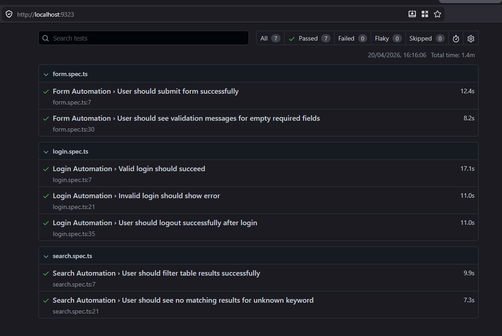
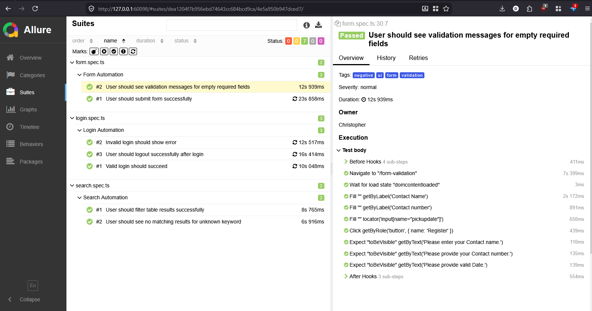
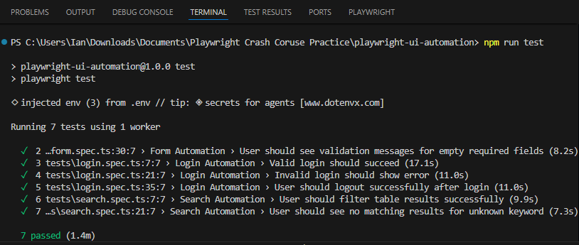

# 🚀 Playwright UI Automation Project

## 📌 Overview

This project is a UI Automation Framework built using **Playwright** and **TypeScript** following the **Page Object Model (POM)** design pattern.

It was created to showcase practical QA Automation skills including login testing, form automation, search validation, reusable framework structure, and reporting.

---

## 🛠 Tech Stack

- Playwright
- TypeScript
- Node.js
- HTML Report
- Allure Report

---

## 📂 Project Structure

```bash
playwright-ui-automation-project/
├── pages/
├── tests/
├── utils/
├── test-data/
├── screenshots/
├── playwright.config.ts
├── package.json
├── tsconfig.json
└── README.md
```

---

## ✅ Automated Test Coverage

### 🔐 Login Automation
- Valid Login
- Invalid Login
- Error Validation

### 📝 Form Automation
- Required Fields Validation
- Successful Submission
- Invalid Input Checks

### 🔍 Search Automation
- Search Existing Data
- Search No Results
- UI Result Validation

---

## 🧱 Framework Design Pattern

This project uses **Page Object Model (POM)** for:

- Better maintainability
- Cleaner test scripts
- Reusable page methods
- Easy scaling for future modules

Example:

```ts
await loginPage.goto();
await loginPage.login(username, password);
```

---

## ⚙️ Installation

Clone repository:

```bash
git clone https://github.com/demilloian/playwright-ui-automation-project.git
cd playwright-ui-automation-project
```

Install dependencies:

```bash
npm install
```

Install Playwright browsers:

```bash
npx playwright install
```

---

## ▶️ Available Scripts

### Run All Tests

```bash
npm run test
```

### Run Headed Mode

```bash
npm run test:headed
```

### Run Login Tests

```bash
npm run test:login
```

### Run Form Tests

```bash
npm run test:form
```

### Run Search Tests

```bash
npm run test:search
```

### Open HTML Report

```bash
npm run report:html
```

### Open Allure Report

```bash
npm run report:allure
```

---

## 📊 Reports

This project supports:

- Playwright HTML Reports
- Allure Interactive Reports

---

## 📸 Screenshots

Add screenshots inside the `screenshots/` folder.

```md



```

---

## 💡 Skills Demonstrated

- Playwright UI Automation
- TypeScript OOP
- Page Object Model
- Assertions & Validations
- Reusable Helper Methods
- Structured Test Framework
- Reporting Tools Integration

---

## 🎯 Why This Project Matters

This project reflects my transition from **Manual QA** to **QA Automation Engineer** by building scalable and maintainable automation solutions using modern tools.

---

## 🚀 Future Improvements

- API Testing using Playwright
- GitHub Actions CI/CD
- Screenshot on Failure
- Cross Browser Execution
- Environment Configurations

---

## 👨‍💻 Author

**Christopher Ian M. Demillo**

- GitHub: https://github.com/demilloian
- LinkedIn: https://www.linkedin.com/in/c-m-d/

---
